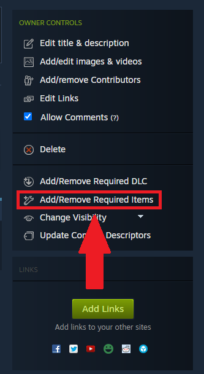

# Steampunch
Allows you to use Facepunch's Steamworks thingy in your Content Warning mods!

## How to get `Facepunch.Steamworks`
1. Download `Facepunch.Steamworks.Win64.dll` from the `Libs` folder in this repository.
2. Add the `Facepunch.Steamworks.Win64.dll` to your mod's project references in the .csproj file.
3. Ensure your mod, when uploaded to the Steam Workshop, has added Steampunch as a dependency/required file.
   - 
4. You're done! You can now use the more friendly `Steamworks` API in your mod!
